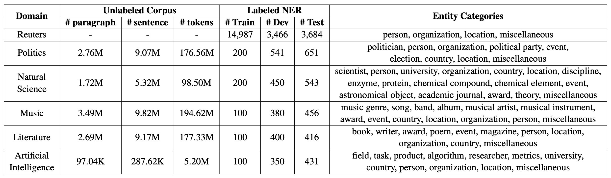
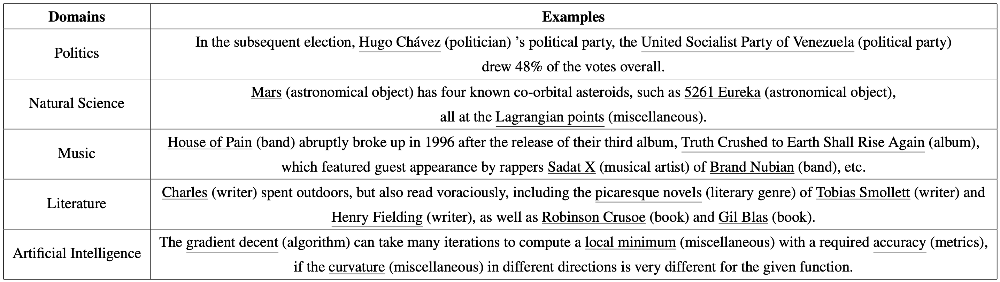
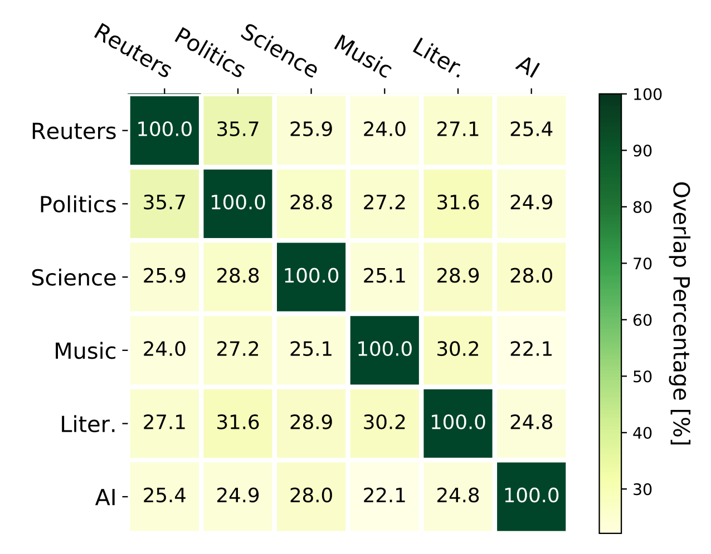

# CrossNER
 [](https://opensource.org/licenses/MIT)


[CrossNER: Evaluating Cross-Domain Named Entity Recognition](https://arxiv.org/abs/2012.04373) (Accepted in AAAI-2021)

CrossNER is a fully-labeled collected of named entity recognition (NER) data spanning over five diverse domains (Politics, Natural Science, Music, Literature, and Artificial Intelligence) with specialized entity categories for different domains. Additionally, CrossNER also includes unlabeled domain-related corpora for the corresponding five domains. We hope that our collected dataset (CrossNER) will catalyze research in the NER domain adaptation area.

If you use the dataset in an academic paper, please consider citing the following paper.
<pre>
@article{liu2020crossner,
      title={CrossNER: Evaluating Cross-Domain Named Entity Recognition}, 
      author={Zihan Liu and Yan Xu and Tiezheng Yu and Wenliang Dai and Ziwei Ji and Samuel Cahyawijaya and Andrea Madotto and Pascale Fung},
      year={2020},
      eprint={2012.04373},
      archivePrefix={arXiv},
      primaryClass={cs.CL}
}
</pre>

## The CrossNER Dataset

### Data Statistics and Entity Categories
Data statistics of unlabeled domain corpora, labeled NER samples and entity categories for each domain.



### Data Examples
Examples for the five domains. We underline the annotated entities with the corresponding annotations in the brackets.


### Domain Overlaps
Vocabulary overlaps between domains (%). Reuters denotes the Reuters News domain, “Science” denotes the natural science domain and “Litera.” denotes the literature domain.



### Download
```Labeled NER data:``` Labeled NER data for the five target domains (Politics, Science, Music, Literature, and AI) and the source domain (Reuters News from [CoNLL-2003 shared task](https://arxiv.org/pdf/cs/0306050.pdf)) can be found in ner_data folder.

```Unlabeled Corpora:``` Unlabeled domain-related corpora (domain-level, entity-level, task-level and integrated) for the five target domains can be downloaded [here](https://drive.google.com/drive/folders/1xDAaTwruESNmleuIsln7IaNleNsYlHGn?usp=sharing).

## Dependency
- Install PyTorch (Tested in PyTorch 1.2.0 and Python 3.6)
- Install transformers (Tested in transformers 3.0.2)

## Domain-Adaptive Pre-Training (DAPT)
- ```--train_data_file:``` the file path of the pre-training corpus.
```console
❱❱❱ python run_language_modeling.py --output_dir=politics_spanlevel_integrated --model_type=bert --model_name_or_path=bert-base-cased --do_train --train_data_file=corpus/politics_integrated.txt --mlm
```
This example is for span-level pre-training using integrated corpus in the politics domain. This code is modified based on run_language_modeling.py from [huggingface transformers](https://github.com/huggingface/transformers/tree/v3.1.0) (3.0.2).

## Baselines

#### Configurations
- ```--tgt_dm:``` Target domain that the model needs to adapt to.
- ```--conll:``` Using source domain data (News domain from CoNLL 2003) for pre-training.
- ```--joint:``` Jointly train using source and target domain data.
- ```--num_tag:``` Number of label types for the target domain (we put the details in src/dataloader.py).
- ```--ckpt:``` Checkpoint path to load the pre-trained model.
- ```--emb_file:``` Word-level embeddings file path.

### Directly Fine-tune
Politics domain. Using the pre-trained model (span-level + integrated corpus).
```console
❱❱❱ python main.py --exp_name politics_directly_finetune --exp_id 1 --num_tag 19 --ckpt politics_spanlevel_integrated/pytorch_model.bin --tgt_dm politics --batch_size 16
```

### Jointly Train
Politics domain. Using the pre-trained model (span-level + integrated corpus).
```console
❱❱❱ python main.py --exp_name politics_jointly_train --exp_id 1 --num_tag 19 --conll --joint --ckpt politics_spanlevel_integrated/pytorch_model.bin --tgt_dm politics
```

### Pre-train then Fine-tune
Politics domain. Using the pre-trained model (span-level + integrated corpus).
```console
❱❱❱ python main.py --exp_name politics_pretrain_then_finetune --exp_id 1 --num_tag 19 --conll --ckpt politics_spanlevel_integrated/pytorch_model.bin --tgt_dm politics --batch_size 16
```

### BiLSTM-CRF ([Lample et al. 2016](https://www.aclweb.org/anthology/N16-1030.pdf))
Politics domain. Word+Char level (using glove.6B.300d.txt for word-level embeddings and torchtext.vocab.CharNGram() for character-level embeddings). Same setting for the Coach baseline.
```console
❱❱❱ python main.py --exp_name politics_bilstm_wordchar --exp_id 1 --num_tag 19 --tgt_dm politics --bilstm --dropout 0.3 --lr 1e-3 --usechar --emb_dim 400
```

### Coach ([Liu et al. 2020](https://www.aclweb.org/anthology/2020.acl-main.3.pdf))
```console
❱❱❱ python main.py --exp_name politics_coach_wordchar --exp_id 1 --num_tag 3 --entity_enc_hidden_dim 200 --tgt_dm politics --coach --dropout 0.5 --lr 1e-4 --usechar --emb_dim 400
```

## Other Notes
- In the aforementioned baselines, we provide running commands for the politics domain as an example. The running commands for other target domains can be found in the [run.sh](run.sh) file.

## Bug Report
- Feel free to create an issue or send an email to zihan.liu@connect.ust.hk.
